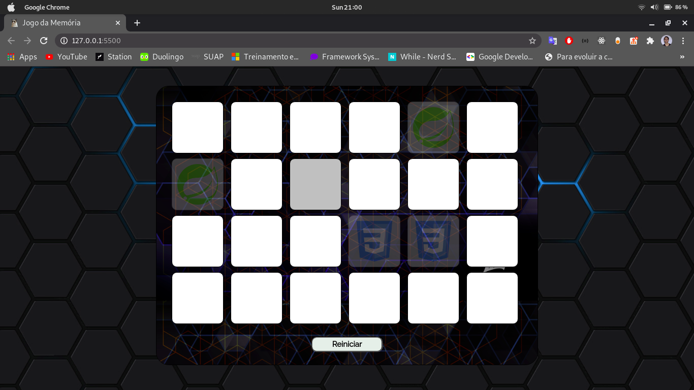

# Jogo da memória

<h3 align="center">
  Um jogo da memória simples, feito com html, css e javascript.
</h3>

 

## Como executar

Para executar este projeto basta abrir o arquivo *index.html*

## Resultado

    </img>

